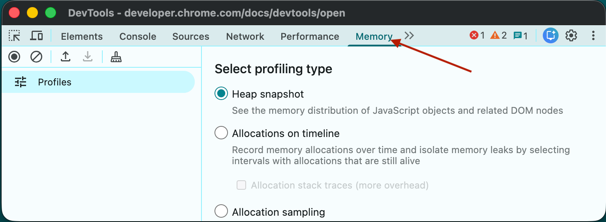
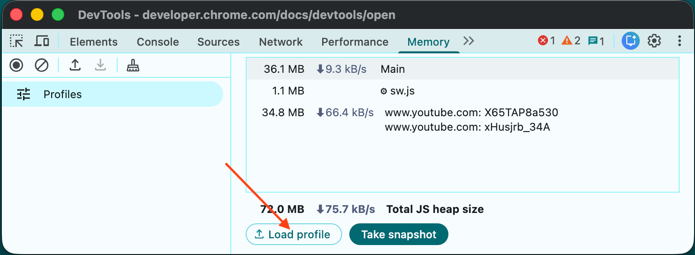
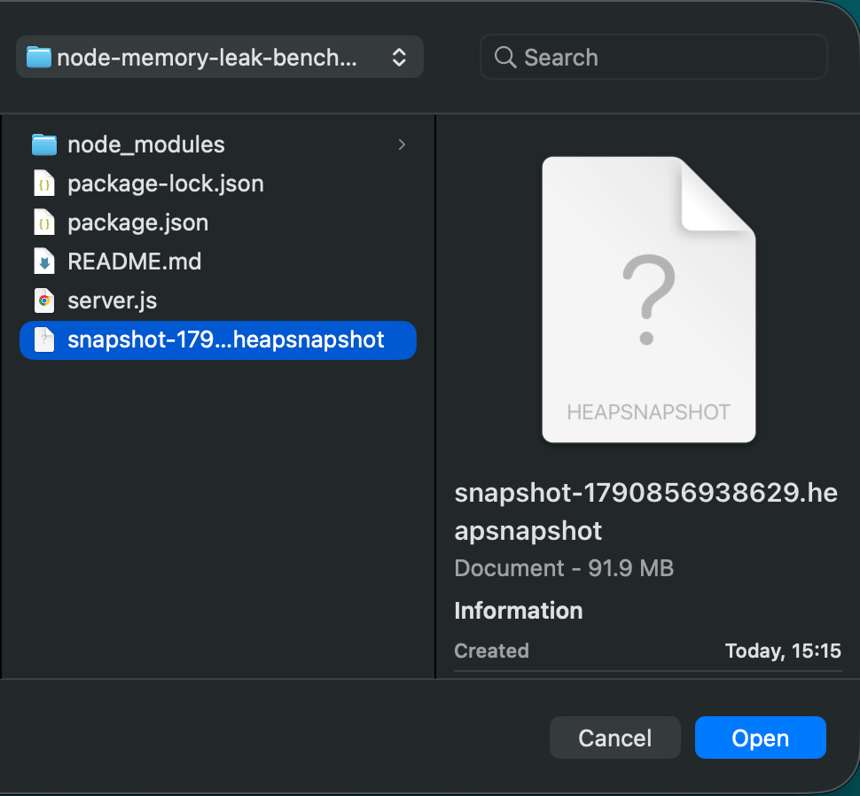
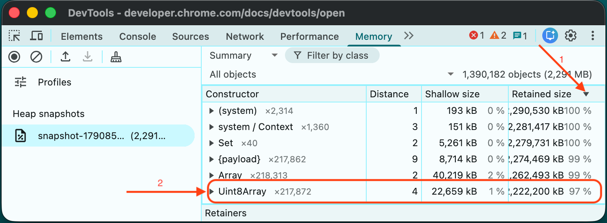

# Node.js Stream Memory Leak Benchmark & Reproduction

This repository contains a minimal, runnable reproduction of a V8 heap memory leak caused by retaining stream buffer chunks in closure scopes, alongside an optimized streaming implementation using Node.js `node:stream/promises` and `pipeline`.

> 📖 **Companion Technical Article:**  
> This repository provides the benchmark code and diagnostic endpoints referenced in the article:  
> **[How I Tracked Down and Fixed a Memory Leak in a Node.js API](https://medium.com/@ohad2712/how-i-tracked-down-and-fixed-a-memory-leak-in-a-node-js-api-4ef63abddd6e?postPublishedType=initial)


## What This Repository Is For

When building high-throughput Node.js microservices or API proxies, buffering raw stream payloads in closure scopes or unmanaged arrays prevents V8 Garbage Collection from freeing underlying `ArrayBuffer` allocations.

This repository allows you to:
1. **Reproduce the Memory Leak:** Run a load test against `/leak` and watch RSS and heap usage grow linearly under load.
2. **Verify the Fix:** Run the same load test against `/fixed` using `pipeline` to observe flat memory usage.
3. **Analyze V8 Heap Snapshots:** Generate `.heapsnapshot` files directly via HTTP and inspect the retainers tree using Chrome DevTools.


## Project Structure

```text
.
├── server.js          # HTTP server (Leaking, Fixed, and Diagnostic endpoints)
├── package.json       # Scripts & dependencies (autocannon)
└── README.md          # Usage instructions

```


## Getting Started

### Prerequisites

* Node.js v18+ (tested on Node.js v26.10.0)
* `npm`

### Installation

1. Clone the repository:
    ```bash
    git clone https://github.com/ohad2712/node-memory-leak-benchmark.git
    cd node-memory-leak-benchmark
    ```


2. Install dependencies:
    ```bash
    npm install
    ```


## How to Run the Benchmarks

### 1. Start the Server

```bash
npm start
```

The server will run on `http://localhost:3000`.


### 2. Test the Leaking Endpoint (`/leak`)

1. Check baseline memory stats in a separate terminal:
```bash
curl http://localhost:3000/stats
```


2. Execute the load test against the leaking endpoint:
```bash
npm run bench:leak
```


3. Check memory stats again:
```bash
curl http://localhost:3000/stats
```

*Notice how `heapUsedMB` and `rssMB` stay elevated due to retained `Buffer` references in the outer scope.*


### 3. Test the Fixed Endpoint (`/fixed`)

1. Stop the server (`Ctrl + C`) and restart it to reset memory:
```bash
npm start
```


2. Execute the load test against the optimized streaming endpoint:
```bash
npm run bench:fixed
```


3. Check memory stats again:
```bash
curl http://localhost:3000/stats
```

*Notice that memory returns to baseline levels after execution.*


## Generating & Profiling V8 Heap Snapshots

To analyze retained objects in Chrome DevTools:

1. Trigger a snapshot during or after a load test:
```bash
curl http://localhost:3000/admin/heap-snapshot
```

2. Open Google Chrome and go to DevTool (`inspect` or `F12`)
3. Select the **Memory** tab.

4. Click **Load profile** at the bottom of the sidebar.

5. Select the generated `snapshot-*.heapsnapshot` file.

5. In the **Summary** view, sort by **Retained Size** to inspect retained `Buffer` and `Uint8Array` objects (to see the percentage of the total heap memory).

